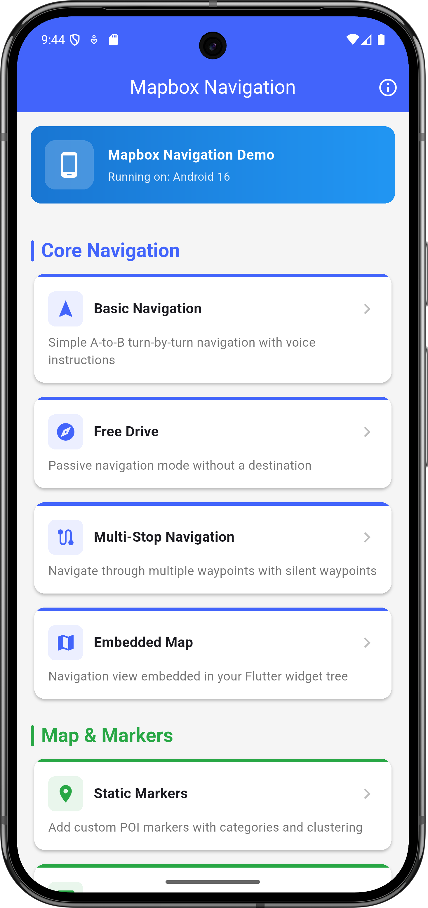
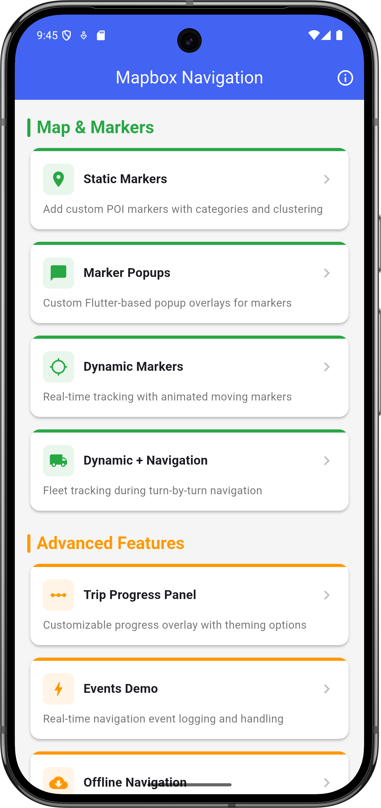
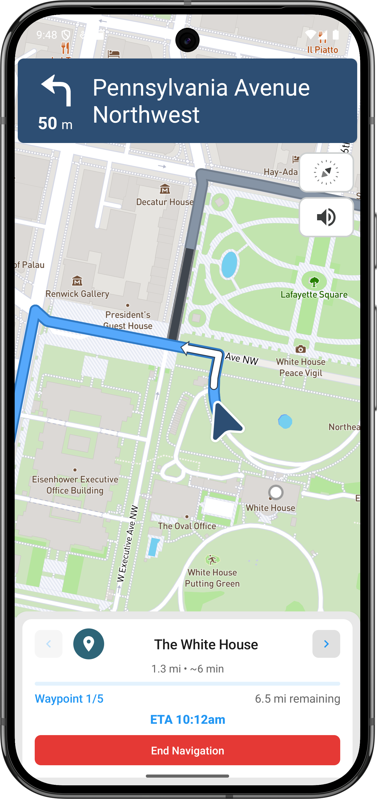
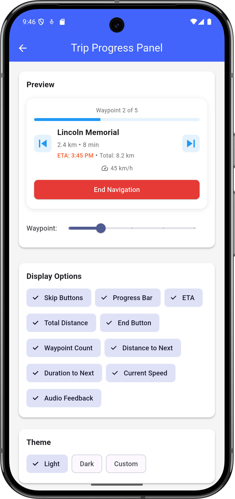
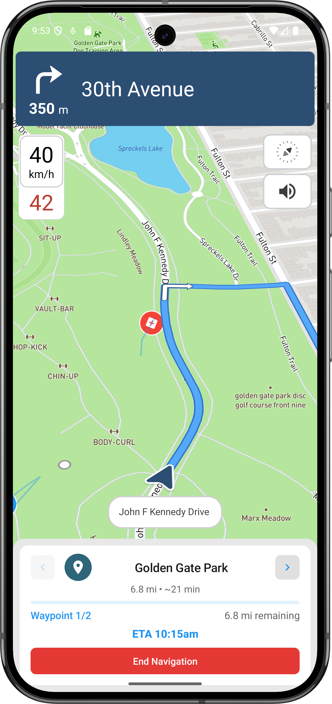
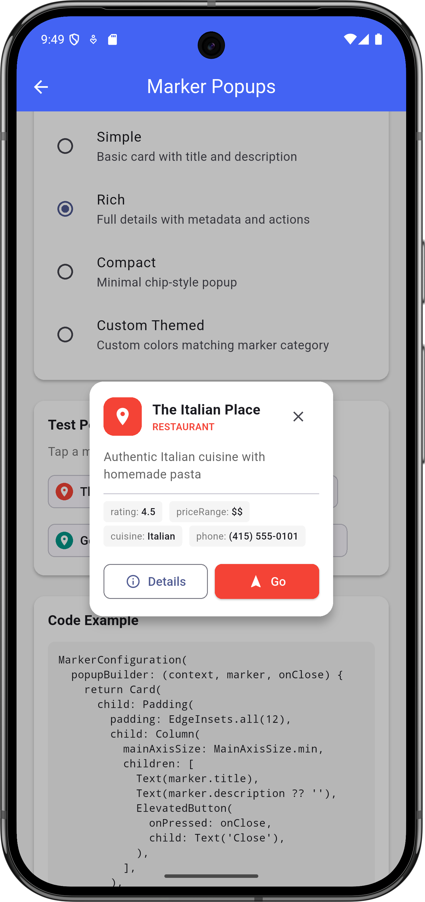
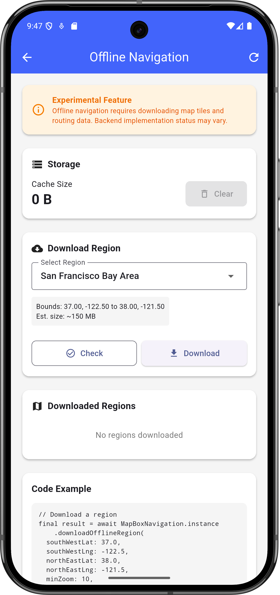

[![Pub][pub_badge]][pub] [![BuyMeACoffee][buy_me_a_coffee_badge]][buy_me_a_coffee]

# flutter_mapbox_navigation

Add Turn By Turn Navigation to Your Flutter Application Using MapBox. Never leave your app when you need to navigate your users to a location.

## Quick Start

```dart
import 'package:flutter_mapbox_navigation/flutter_mapbox_navigation.dart';

// Define your waypoints
final origin = WayPoint(name: "Origin", latitude: 37.7749, longitude: -122.4194);
final destination = WayPoint(name: "Destination", latitude: 37.3382, longitude: -121.8863);

// Start navigation
await MapBoxNavigation.instance.startNavigation(
  wayPoints: [origin, destination],
  options: MapBoxOptions(
    mode: MapBoxNavigationMode.drivingWithTraffic,
    simulateRoute: true,  // Set to false for real navigation
    language: "en",
  ),
);
```

> **Note:** Before using the plugin, complete the [Setup Instructions](#setup-instructions) below to configure your Mapbox access tokens.

## Features

### Core Navigation Features
* A full-fledged turn-by-turn navigation UI for Flutter that's ready to drop into your application
* Worldwide driving, cycling, and walking directions powered by [open data](https://www.mapbox.com/about/open/) and user feedback
* Traffic avoidance and proactive rerouting based on current conditions in [over 55 countries](https://docs.mapbox.com/help/how-mapbox-works/directions/#traffic-data)
* **Free Drive Mode** - Passive navigation without a set destination
* **Multi-stop Navigation** - Support for multiple waypoints with dynamic additions
* **Route Simulation** - Test navigation with simulated movement

### Map & UI Features
* [Professionally designed map styles](https://www.mapbox.com/maps/) for daytime and nighttime driving
* **Embedded Navigation View** - Customizable navigation UI that integrates seamlessly into your app
* Support for multiple waypoints and route alternatives
* **Map Controller** - Full programmatic control over navigation state and map interactions

### Voice & Language Features
* Natural-sounding turn instructions powered by [Amazon Polly](https://aws.amazon.com/polly/) (no configuration needed)
* [Support for over two dozen languages](https://docs.mapbox.com/ios/navigation/overview/localization-and-internationalization/)
* Customizable voice instructions and banner guidance
* **Unit System Support** - Imperial and metric units (note: voice units are locked at first initialization)

### Advanced Features
* **Event-Driven Architecture** - Comprehensive event system for navigation progress, route updates, and user interactions
* **Static Markers** - Display custom points of interest with interactive markers and clustering
* **Dynamic Markers** - Real-time visualization of moving entities with smooth 60fps animated transitions
* **Offline Navigation** - Download map tiles and routing data for offline use with progress tracking
* **Modern Android Support** - Android 13+ compatibility with enhanced security
* **Type-Safe API** - Improved error handling and type safety across all platforms

## Setup Instructions

### Prerequisites
1. A Mapbox account with access tokens
2. Flutter development environment set up (SDK >=2.19.4, Flutter >=2.5.0)
3. iOS and/or Android development environment configured

### iOS Configuration

1. **Download Token Setup**
   - Go to your [Mapbox account dashboard](https://account.mapbox.com/)
   - Create an access token with the `DOWNLOADS:READ` scope
   - **IMPORTANT**: This is different from your production API token
   - Create or edit `.netrc` in your home directory:
     ```
     machine api.mapbox.com
       login mapbox
       password YOUR_DOWNLOAD_TOKEN
     ```

2. **API Token Configuration**
   - Get your API token from [Mapbox account page](https://account.mapbox.com/access-tokens/)
   - In Xcode, select your target → Info tab
   - Add `MBXAccessToken` with your token value
   - **SECURITY**: Never commit your token to source control

3. **Location & Background Setup**
   - Add `NSLocationWhenInUseUsageDescription` to Info.plist:
     ```xml
     <key>NSLocationWhenInUseUsageDescription</key>
     <string>Shows your location on the map and helps improve OpenStreetMap.</string>
     ```
   - Enable background modes in Xcode:
     - Audio, AirPlay, and Picture in Picture
     - Location updates

### Android Configuration

1. **API Token Setup**
   - Create `mapbox_access_token.xml` in `android/app/src/main/res/values/`
   - Add your token (never commit this file):
     ```xml
     <?xml version="1.0" encoding="utf-8"?>
     <resources xmlns:tools="http://schemas.android.com/tools">
         <string name="mapbox_access_token" translatable="false" tools:ignore="UnusedResources">YOUR_TOKEN_HERE</string>
     </resources>
     ```

2. **Permissions**
   - Add to `AndroidManifest.xml`:
     ```xml
     <uses-permission android:name="android.permission.ACCESS_COARSE_LOCATION" />
     <uses-permission android:name="android.permission.ACCESS_FINE_LOCATION" />
     <uses-permission android:name="android.permission.ACCESS_NETWORK_STATE" />
     ```

3. **Download Token Setup**
   - Add to `gradle.properties`:
     ```
     MAPBOX_DOWNLOADS_TOKEN=YOUR_DOWNLOAD_TOKEN
     ```
   - **SECURITY**: Add this file to .gitignore

4. **Activity Configuration**
   - Update `MainActivity.kt`:
     ```kotlin
     import io.flutter.embedding.android.FlutterFragmentActivity
     
     class MainActivity: FlutterFragmentActivity() {
     }
     ```

5. **Kotlin Version**
   - Add to `android/app/build.gradle`:
     ```gradle
     implementation platform("org.jetbrains.kotlin:kotlin-bom:1.8.0")
     ```

## Usage Examples

### Complete Minimal Example

Here's a complete, working example you can copy into your project:

```dart
import 'package:flutter/material.dart';
import 'package:flutter_mapbox_navigation/flutter_mapbox_navigation.dart';

class NavigationExample extends StatefulWidget {
  const NavigationExample({super.key});

  @override
  State<NavigationExample> createState() => _NavigationExampleState();
}

class _NavigationExampleState extends State<NavigationExample> {
  String _instruction = "";
  bool _isNavigating = false;
  double? _distanceRemaining;
  double? _durationRemaining;

  // Define your waypoints
  final _origin = WayPoint(
    name: "San Francisco",
    latitude: 37.7749,
    longitude: -122.4194,
  );
  final _destination = WayPoint(
    name: "San Jose",
    latitude: 37.3382,
    longitude: -121.8863,
  );

  @override
  void initState() {
    super.initState();
    // Register event listener for navigation updates
    MapBoxNavigation.instance.registerRouteEventListener(_onRouteEvent);
  }

  Future<void> _startNavigation() async {
    await MapBoxNavigation.instance.startNavigation(
      wayPoints: [_origin, _destination],
      options: MapBoxOptions(
        mode: MapBoxNavigationMode.drivingWithTraffic,
        simulateRoute: true,
        language: "en",
        units: VoiceUnits.metric,
      ),
    );
  }

  Future<void> _onRouteEvent(RouteEvent event) async {
    // Update distance/duration remaining
    _distanceRemaining = await MapBoxNavigation.instance.getDistanceRemaining();
    _durationRemaining = await MapBoxNavigation.instance.getDurationRemaining();

    switch (event.eventType) {
      case MapBoxEvent.progress_change:
        final progress = event.data as RouteProgressEvent;
        if (progress.currentStepInstruction != null) {
          _instruction = progress.currentStepInstruction!;
        }
        break;
      case MapBoxEvent.navigation_running:
        _isNavigating = true;
        break;
      case MapBoxEvent.on_arrival:
        // Handle arrival at destination
        await Future.delayed(const Duration(seconds: 3));
        await MapBoxNavigation.instance.finishNavigation();
        break;
      case MapBoxEvent.navigation_finished:
      case MapBoxEvent.navigation_cancelled:
        _isNavigating = false;
        break;
      default:
        break;
    }
    setState(() {});
  }

  @override
  Widget build(BuildContext context) {
    return Scaffold(
      appBar: AppBar(title: const Text('Navigation Demo')),
      body: Center(
        child: Column(
          mainAxisAlignment: MainAxisAlignment.center,
          children: [
            ElevatedButton(
              onPressed: _isNavigating ? null : _startNavigation,
              child: const Text('Start Navigation'),
            ),
            const SizedBox(height: 20),
            if (_instruction.isNotEmpty) Text('Next: $_instruction'),
            if (_distanceRemaining != null)
              Text('Distance: ${(_distanceRemaining! / 1000).toStringAsFixed(1)} km'),
            if (_durationRemaining != null)
              Text('Duration: ${(_durationRemaining! / 60).toStringAsFixed(0)} min'),
          ],
        ),
      ),
    );
  }
}
```

### Basic Navigation Setup

```dart
// 1. Configure default options (optional)
MapBoxNavigation.instance.setDefaultOptions(MapBoxOptions(
    initialLatitude: 36.1175275,
    initialLongitude: -115.1839524,
    zoom: 13.0,
    tilt: 0.0,
    bearing: 0.0,
    enableRefresh: false,
    alternatives: true,
    voiceInstructionsEnabled: true,
    bannerInstructionsEnabled: true,
    allowsUTurnAtWayPoints: true,
    mode: MapBoxNavigationMode.drivingWithTraffic,
    units: VoiceUnits.imperial,
    simulateRoute: true,
    language: "en"
));

// 2. Define waypoints
final cityhall = WayPoint(
    name: "City Hall", 
    latitude: 42.886448, 
    longitude: -78.878372
);
final downtown = WayPoint(
    name: "Downtown Buffalo", 
    latitude: 42.8866177, 
    longitude: -78.8814924
);

// 3. Start navigation
await MapBoxNavigation.instance.startNavigation(
    wayPoints: [cityhall, downtown]
);
```

### Waypoint Properties

Waypoints support several properties to customize navigation behavior:

```dart
final waypoint = WayPoint(
    name: "Stop Name",           // Required: Display name for the waypoint
    latitude: 42.886448,         // Required: Latitude coordinate
    longitude: -78.878372,       // Required: Longitude coordinate
    isSilent: false,             // Optional: Whether to announce this waypoint (default: false)
);
```

#### Silent Waypoints (`isSilent`)

Silent waypoints are used for route shaping without announcing them to the user:

- **`isSilent: false`** (default): Waypoint will be announced with voice and banner instructions
- **`isSilent: true`**: Waypoint is used for route calculation but not announced

**Important Rules:**
- First and last waypoints **cannot** be silent (they will always be announced)
- Silent waypoints are useful for:
  - Route optimization (avoiding certain areas)
  - Traffic avoidance
  - Creating smoother routes
  - Intermediate points that don't need announcements

**Example with Silent Waypoints:**
```dart
final wayPoints = [
    WayPoint(name: "Start", latitude: 42.886448, longitude: -78.878372),           // Always announced
    WayPoint(name: "Route Point", latitude: 42.8866177, longitude: -78.8814924, isSilent: true),  // Silent
    WayPoint(name: "End", latitude: 42.8866177, longitude: -78.8814924),           // Always announced
];
```

#### Waypoint Validation

The `WayPoint` class includes built-in validation:

- **Name**: Required and cannot be empty or whitespace-only
- **Coordinates**: Must be valid latitude (-90 to 90) and longitude (-180 to 180)
- **Silent Rules**: First and last waypoints cannot be silent
- **Duplicate Prevention**: Coordinates must be unique within a route

**Basic Validation Examples:**
```dart
// ✅ Valid waypoints
WayPoint(name: "Valid Stop", latitude: 42.886448, longitude: -78.878372);
WayPoint(name: "Silent Point", latitude: 42.8866177, longitude: -78.8814924, isSilent: true);

// ❌ Invalid waypoints (will throw FormatException)
WayPoint(name: "", latitude: 42.886448, longitude: -78.878372);                    // Empty name
WayPoint(name: "Invalid", latitude: 91.0, longitude: -78.878372);                 // Invalid latitude
WayPoint(name: "Invalid", latitude: 42.886448, longitude: 181.0);                 // Invalid longitude
```

**API Limit Validation:**
```dart
// Validate waypoint count against Mapbox API limits
final waypoints = [
    WayPoint(name: "Start", latitude: 37.774406, longitude: -122.435397),
    WayPoint(name: "Stop 1", latitude: 37.784406, longitude: -122.445397),
    // ... more waypoints
];

final validation = WayPoint.validateWaypointCount(waypoints);
if (!validation.isValid) {
    print("❌ Validation failed: ${validation.warnings.join(', ')}");
} else if (validation.hasWarnings) {
    print("⚠️  Warnings: ${validation.warnings.join(', ')}");
    print("💡 Recommendations: ${validation.recommendations.join(', ')}");
} else {
    print("✅ Waypoints are valid");
}

// Get formatted validation message
print(validation.formattedMessage);
```

#### Best Practices

1. **Naming Strategy:**
   - Use descriptive names for important stops
   - Keep names concise but informative
   - Consider user context when naming waypoints

2. **Silent Waypoint Usage:**
   - Use for route optimization and traffic avoidance
   - Avoid overusing silent waypoints (can make routes confusing)
   - Remember: first and last waypoints are always announced

3. **Coordinate Accuracy:**
   - Use precise coordinates for accurate navigation
   - Consider using geocoding services for address-to-coordinate conversion
   - Validate coordinates before creating waypoints

4. **Platform Limitations:**
   - **iOS**: Cannot use `drivingWithTraffic` mode with more than 3 waypoints
   - **Android**: No waypoint count limitations for traffic mode
   - **Both**: Minimum 2 waypoints required, no maximum enforced
   - **Mapbox API**: Officially supports up to 25 waypoints, but this is not enforced in the plugin

### Free Drive Mode

```dart
// Start free drive mode (passive navigation without destination)
await MapBoxNavigation.instance.startFreeDrive(
    options: MapBoxOptions(
        initialLatitude: 36.1175275,
        initialLongitude: -115.1839524,
        zoom: 15.0,
        mode: MapBoxNavigationMode.drivingWithTraffic,
        units: VoiceUnits.metric,
        language: "en"
    )
);
```

### Multi-Stop Navigation

```dart
// Define multiple waypoints
final waypoints = [
    WayPoint(name: "Start", latitude: 37.774406, longitude: -122.435397),                    // Always announced
    WayPoint(name: "Route Point", latitude: 37.765569, longitude: -122.424098, isSilent: true), // Silent - no announcement
    WayPoint(name: "Stop 1", latitude: 37.784406, longitude: -122.445397, isSilent: false),  // Announced
    WayPoint(name: "Destination", latitude: 37.794406, longitude: -122.455397),              // Always announced
];

// Start multi-stop navigation
await MapBoxNavigation.instance.startNavigation(
    wayPoints: waypoints,
    options: MapBoxOptions(
        mode: MapBoxNavigationMode.driving,
        simulateRoute: true,
        allowsUTurnAtWayPoints: true
    )
);

// Add waypoints during navigation
await Future.delayed(Duration(seconds: 10));
final newStop = WayPoint(
    name: "Gas Station",
    latitude: 37.774406,
    longitude: -122.435397,
    isSilent: false
);

// addWayPoints returns a WaypointResult with success status and count
final result = await MapBoxNavigation.instance.addWayPoints(wayPoints: [newStop]);
if (result.success) {
    print("Added ${result.waypointsAdded} waypoints successfully");
} else {
    print("Failed to add waypoints: ${result.errorMessage}");
}
```

**Multi-stop Navigation Features:**
- **Multiple waypoints** per route (minimum 2, no maximum enforced)
- **Dynamic waypoint addition** during navigation with `WaypointResult` feedback
- **Silent waypoints** for route optimization without announcements
- **Automatic route recalculation** when waypoints are added
- **Voice and banner instructions** for each announced waypoint
- **Arrival events** for each waypoint (except silent ones)

**WaypointResult Class:**
The `addWayPoints` method returns a `WaypointResult` object:
```dart
class WaypointResult {
  final bool success;           // Whether waypoints were added successfully
  final int waypointsAdded;     // Number of waypoints actually added
  final String? errorMessage;   // Error message if addition failed
}
```

### Event Handling

```dart
// Register for navigation events
MapBoxNavigation.instance.registerRouteEventListener(_onRouteEvent);

Future<void> _onRouteEvent(e) async {
    // Get remaining distance and duration
    _distanceRemaining = await MapBoxNavigation.instance.getDistanceRemaining();
    _durationRemaining = await MapBoxNavigation.instance.getDurationRemaining();

    // Handle different event types
    switch (e.eventType) {
        case MapBoxEvent.progress_change:
            var progressEvent = e.data as RouteProgressEvent;
            _arrived = progressEvent.arrived;
            if (progressEvent.currentStepInstruction != null) {
                _instruction = progressEvent.currentStepInstruction;
            }
            break;
            
        case MapBoxEvent.route_building:
        case MapBoxEvent.route_built:
            _routeBuilt = true;
            break;
            
        case MapBoxEvent.route_build_failed:
            _routeBuilt = false;
            break;
            
        case MapBoxEvent.navigation_running:
            _isNavigating = true;
            break;
            
        case MapBoxEvent.on_arrival:
            _arrived = true;
            if (!_isMultipleStop) {
                await Future.delayed(Duration(seconds: 3));
                await MapBoxNavigation.instance.finishNavigation();
            }
            break;
            
        case MapBoxEvent.navigation_finished:
        case MapBoxEvent.navigation_cancelled:
            _routeBuilt = false;
            _isNavigating = false;
            break;
    }
    
    // Update UI
    setState(() {});
}
```

### Static Markers

Display custom points of interest on the map with interactive markers, clustering, and rich metadata support.

```dart
// 1. Create static markers
final markers = [
  StaticMarker(
    id: 'scenic_1',
    latitude: 37.7749,
    longitude: -122.4194,
    title: 'Golden Gate Bridge',
    category: 'scenic',
    description: 'Iconic suspension bridge',
    iconId: MarkerIcons.scenic,
    customColor: Colors.orange,
    priority: 5,
    metadata: {'rating': 4.8, 'best_time': 'sunset'},
  ),
  StaticMarker(
    id: 'petrol_1',
    latitude: 37.7849,
    longitude: -122.4094,
    title: 'Shell Gas Station',
    category: 'petrol_station',
    description: '24/7 fuel station',
    iconId: MarkerIcons.petrolStation,
    customColor: Colors.green,
    metadata: {'price': 1.85, 'brand': 'Shell'},
  ),
];

// 2. Add markers to map
await MapBoxNavigation.instance.addStaticMarkers(
  markers: markers,
  configuration: MarkerConfiguration(
    maxDistanceFromRoute: 5.0, // 5km from route
    enableClustering: true,
    onMarkerTap: (marker) {
      print('Tapped: ${marker.title}');
    },
  ),
);

// 3. Handle marker taps
await MapBoxNavigation.instance.registerStaticMarkerTapListener(
  (marker) {
    showDialog(
      context: context,
      builder: (context) => AlertDialog(
        title: Text(marker.title),
        content: Text(marker.description ?? ''),
        actions: [
          TextButton(
            onPressed: () => Navigator.pop(context),
            child: const Text('Close'),
          ),
        ],
      ),
    );
  },
);

// 4. Remove markers when done
await MapBoxNavigation.instance.clearAllStaticMarkers();
```

**Static Marker Features:**
- **30+ Predefined Icons** across 5 categories (Transportation, Food & Services, Scenic & Recreation, Safety & Traffic, General)
- **Flexible Categories** - String-based categories defined by developers
- **Rich Metadata** - Custom data for each marker type
- **Smart Clustering** - Automatic clustering for dense areas
- **Distance Filtering** - Show only markers within specified distance from route
- **Interactive** - Tap callbacks with detailed information display
- **Performance Optimized** - Configurable limits and efficient rendering

> **📝 Icon Coverage**: Both iOS and Android have complete icon coverage for all 33 marker types.

For detailed documentation, see [Static Markers Guide](doc/static_markers.md).

### Dynamic Markers

Display moving entities on the map with smooth animated transitions. Unlike static markers, dynamic markers continuously update their position based on an external data stream with native-level animation for smooth 60fps movement.

```dart
// 1. Add a dynamic marker
final marker = DynamicMarker(
  id: 'vehicle_123',
  latitude: 37.7749,
  longitude: -122.4194,
  title: 'Delivery Van',
  category: 'vehicle',
  iconId: MarkerIcons.vehicle,
  heading: 45.0,
  speed: 15.5,
  showTrail: true,
  metadata: {
    'driverId': 'D-001',
    'licensePlate': 'ABC123',
    'status': 'in_transit',
  },
);

await MapBoxNavigation.instance.addDynamicMarker(
  marker: marker,
  configuration: DynamicMarkerConfiguration(
    animationDurationMs: 1000,
    enableTrail: true,
    staleThresholdMs: 10000,
    onMarkerTap: (marker) => print('Tapped: ${marker.title}'),
  ),
);

// 2. Update marker position (triggers smooth animation)
await MapBoxNavigation.instance.updateDynamicMarkerPosition(
  update: DynamicMarkerPositionUpdate(
    markerId: 'vehicle_123',
    latitude: 37.7760,
    longitude: -122.4180,
    heading: 90.0,
    speed: 18.0,
    timestamp: DateTime.now(),
  ),
);

// 3. Subscribe to a stream for real-time updates
final subscription = MapBoxNavigation.instance.subscribeToDynamicMarkerUpdates(
  updateStream: myWebSocketStream.map((msg) => DynamicMarkerPositionUpdate(
    markerId: msg.entityId,
    latitude: msg.lat,
    longitude: msg.lng,
    heading: msg.heading,
    speed: msg.speed,
    timestamp: msg.timestamp,
  )),
);

// 4. Remove markers when done
await MapBoxNavigation.instance.clearAllDynamicMarkers();
```

**Dynamic Marker Features:**
- **Smooth Animation** - Native-level 60fps position interpolation between updates
- **Heading Rotation** - Markers rotate smoothly to face their direction of travel
- **Trail/Breadcrumb** - Optional trail showing where the entity has been
- **State Management** - Automatic tracking, stale, offline, and expired states
- **Entity-Agnostic** - Track vehicles, people, drones, deliveries, or any moving entity
- **Stream Integration** - Subscribe to any real-time data source (WebSocket, Firebase, MQTT, etc.)
- **Position Prediction** - Dead-reckoning when updates are delayed
- **Rich Metadata** - Store arbitrary entity-specific data with each marker

**Marker States:**
| State | Description |
|-------|-------------|
| `tracking` | Actively receiving position updates |
| `animating` | Currently animating between positions |
| `stationary` | Entity has stopped moving |
| `stale` | No update received within threshold (visual indicator shown) |
| `offline` | No update for extended period |
| `expired` | About to be auto-removed |

For detailed documentation, see [Dynamic Markers Guide](doc/features/12-dynamic-markers.md).

### Trip Progress Panel

Customize the trip progress panel that shows navigation progress, waypoint information, and allows users to skip/go back to waypoints.

```dart
// 1. Use the fluent builder API
final config = TripProgressConfigBuilder()
  .withSkipButtons()           // Enable skip prev/next buttons
  .withProgressBar()           // Show progress bar
  .withEta()                   // Show estimated arrival time
  .withWaypointCount()         // Show "Waypoint 3/8"
  .withDarkTheme()             // Apply dark theme
  .build();

// 2. Or use factory methods
final defaultConfig = TripProgressConfig.defaults();  // All features enabled
final minimalConfig = TripProgressConfig.minimal();   // Essential features only

// 3. Or create with custom options
final customConfig = TripProgressConfig(
  showSkipButtons: true,
  showProgressBar: true,
  showEta: true,
  showTotalDistance: true,
  showEndNavigationButton: true,
  showWaypointCount: true,
  showDistanceToNext: true,
  showDurationToNext: true,
  enableAudioFeedback: true,
  theme: TripProgressTheme.light(),
);

// 4. Start navigation with custom trip progress
await MapBoxNavigation.instance.startNavigation(
  wayPoints: waypoints,
  options: MapBoxOptions(
    tripProgressConfig: config,
    // ... other options
  ),
);
```

**Custom Theme Builder:**
```dart
// Create a custom theme based on light/dark presets
final customTheme = TripProgressThemeBuilder()
  .fromLight()                                    // Start with light theme
  .primaryColor(Colors.indigo)                    // Custom primary color
  .accentColor(Colors.amber)                      // Checkpoint accent color
  .backgroundColor(Color(0xFFFAFAFA))             // Panel background
  .endButtonColor(Colors.red)                     // End navigation button
  .cornerRadius(20.0)                             // Rounded corners
  .addCategoryColor('checkpoint', Colors.orange)  // Custom category color
  .addCategoryColor('scenic', Colors.green)
  .build();

final config = TripProgressConfigBuilder()
  .withTheme(customTheme)
  .build();
```

**Trip Progress Features:**
- **Skip/Previous Buttons** - Navigate between waypoints during navigation
- **Progress Bar** - Visual indicator of trip progress
- **Waypoint Count** - Shows current waypoint position (e.g., "Waypoint 3/8")
- **Distance/Duration** - Shows distance and time to next waypoint
- **ETA** - Estimated time of arrival
- **End Navigation** - Button to stop navigation
- **Theming** - Full customization of colors, dimensions, and category colors
- **Cross-Platform** - Consistent API on both iOS and Android

**Category Colors:**
Category colors are used for waypoint icons. Default categories include:
- `checkpoint` - Important stops (orange)
- `waypoint` - Regular waypoints (blue)
- `poi` - Points of interest (green)
- `scenic` - Scenic viewpoints (light green)
- `restaurant`, `food` - Dining locations (orange)
- `hotel`, `accommodation` - Lodging (purple)
- `petrol_station`, `fuel` - Fuel stops (blue grey)
- `hospital`, `medical` - Medical facilities (red)
- `charging_station` - EV charging (cyan)

### Offline Navigation

Download map tiles and routing data for offline use. This allows navigation without an internet connection.

```dart
// 1. Download a region for offline use
final result = await MapBoxNavigation.instance.downloadOfflineRegion(
  southWestLat: 46.0,
  southWestLng: 6.0,
  northEastLat: 47.0,
  northEastLng: 7.0,
  minZoom: 10,
  maxZoom: 16,
  includeRoutingTiles: true, // Enable offline navigation
  onProgress: (progress) {
    print('Download: ${(progress * 100).toStringAsFixed(0)}%');
  },
);

if (result?['success'] == true) {
  print('Downloaded region: ${result!['regionId']}');
}

// 2. Check if offline routing is available for a location
final isAvailable = await MapBoxNavigation.instance.isOfflineRoutingAvailable(
  latitude: 46.5,
  longitude: 6.5,
);

// 3. List all downloaded regions
final regions = await MapBoxNavigation.instance.listOfflineRegions();
if (regions != null) {
  print('Total regions: ${regions['totalCount']}');
  print('Total size: ${(regions['totalSizeBytes'] / 1024 / 1024).toStringAsFixed(1)} MB');
}

// 4. Get status of a specific region
final status = await MapBoxNavigation.instance.getOfflineRegionStatus(
  regionId: 'region_46000_6000_47000_7000_nav',
);

// 5. Get cache size
final sizeBytes = await MapBoxNavigation.instance.getOfflineCacheSize();
print('Cache size: ${(sizeBytes / 1024 / 1024).toStringAsFixed(1)} MB');

// 6. Delete a specific region
await MapBoxNavigation.instance.deleteOfflineRegion(
  southWestLat: 46.0,
  southWestLng: 6.0,
  northEastLat: 47.0,
  northEastLng: 7.0,
);

// 7. Clear all offline data
await MapBoxNavigation.instance.clearOfflineCache();
```

**Offline Navigation Features:**
- **Region Downloads**: Download specific geographic areas by bounding box coordinates
- **Progress Tracking**: Real-time download progress callbacks (0.0 to 1.0)
- **Routing Tiles**: Optional download of turn-by-turn navigation data
- **Cache Management**: List, check status, and delete offline regions
- **Size Monitoring**: Track offline cache size on device

**API Methods:**
| Method | Description |
|--------|-------------|
| `downloadOfflineRegion()` | Download map tiles and optional routing data for a region |
| `isOfflineRoutingAvailable()` | Check if offline routing is available for a location |
| `listOfflineRegions()` | List all downloaded regions with status |
| `getOfflineRegionStatus()` | Get status of a specific region |
| `getOfflineCacheSize()` | Get total cache size in bytes |
| `deleteOfflineRegion()` | Delete offline data for a specific region |
| `clearOfflineCache()` | Clear all offline data |

### Embedded Navigation View

```dart
// 1. Declare controller
MapBoxNavigationViewController? _controller;

// 2. Add to widget tree
Container(
    height: 300,
    child: MapBoxNavigationView(
        options: _options,
        onRouteEvent: _onRouteEvent,
        onCreated: (MapBoxNavigationViewController controller) async {
            _controller = controller;
            await controller.initialize();
        }
    ),
)

// 3. Build and start navigation
var wayPoints = [
    _origin,
    _stop1,
    _stop2,
    _stop3,
    _stop4,
    _origin
];

// Build the route
await _controller?.buildRoute(wayPoints: wayPoints);

// Start navigation
await _controller?.startNavigation();

// Free drive in embedded view
await _controller?.startFreeDrive();
```

## Screenshots

### Navigation & Features

| Feature | Screenshot |
|:--------|:----------:|
| **Menu & Options** |  |
| **Turn-by-Turn Navigation** |  |
| **Multi-Stop Navigation** |  |
| **Trip Progress Panel** |  |
| **Dynamic Markers** |  |
| **Marker Popups** |  |
| **Offline Navigation** |  |

## Platform Support

| Platform | Status | Notes |
|----------|--------|-------|
| iOS | ✅ Fully Supported | iOS 10+ required |
| Android | ✅ Fully Supported | API 21+ required, Android 13+ optimized |

## Roadmap
* [DONE] Android Implementation
* [DONE] Add more settings like Navigation Mode (driving, walking, etc)
* [DONE] Stream Events like relevant navigation notifications, metrics, current location, etc.
* [DONE] Embeddable Navigation View
* [DONE] Free Drive Mode
* [DONE] Multi-stop Navigation
* [DONE] Enhanced Error Handling
* [DONE] Android 13+ Security Updates
* [DONE] Static Markers System
* [DONE] Trip Progress Panel with waypoint skipping
* [DONE] Offline Navigation (map tiles and routing data)
* [DONE] Dynamic Markers (real-time entity tracking with smooth animation)
* [PLANNED] Vehicle Movement Simulation
* [PLANNED] Enhanced UI Components

## Technical Notes

### Voice Instruction Units
Voice instruction units are locked at first initialization of the navigation session by design in the Mapbox SDK. While display units can be changed at runtime, voice instructions will maintain their initial units throughout the navigation session.

### Android Security
The plugin has been updated for Android 13+ compatibility with proper receiver registration and enhanced security measures.

### Offline Navigation
The plugin supports downloading map tiles and routing data for offline use. Key features include:
- **Region Downloads**: Download specific geographic areas by bounding box
- **Progress Tracking**: Monitor download progress with callbacks
- **Cache Management**: List, check status, and delete offline regions
- **Routing Tiles**: Optional download of routing data for turn-by-turn navigation offline

> **Note**: The legacy `enableOfflineRouting()` method is deprecated. Use `downloadOfflineRegion()` instead for full control over offline data.

### Mapbox API Limits

This plugin uses the Mapbox Directions API for route calculation. Understanding these limits helps ensure reliable navigation:

#### Waypoint Limits
- **Official Limit**: Up to 25 waypoints per route request
- **Plugin Behavior**: No enforcement of this limit in the plugin code
- **Recommendation**: Stay within 25 waypoints for optimal performance
- **Exceeding Limits**: May result in API errors or degraded performance

#### Rate Limits
- **Free Tier**: 100,000 requests per month
- **Paid Tiers**: Higher limits based on your Mapbox plan
- **Request Types**: Each navigation start counts as one request
- **Monitoring**: Check your Mapbox dashboard for usage

#### Distance Limits
- **Maximum Route Distance**: 10,000 km (6,214 miles) per route
- **Coordinate Precision**: 6 decimal places recommended
- **Global Coverage**: Available worldwide with varying data quality

#### Performance Considerations
- **Route Calculation Time**: Increases with more waypoints
- **Network Usage**: Each route request uses data
- **Caching**: Routes are not cached by default
- **Offline**: Limited offline capabilities (see Offline Routing Status above)

#### Best Practices
1. **Waypoint Count**: Keep routes under 25 waypoints when possible
2. **Route Optimization**: Use silent waypoints for route shaping
3. **Error Handling**: Implement fallbacks for API failures
4. **Monitoring**: Track API usage to avoid rate limits
5. **Testing**: Test with realistic waypoint counts in your app

## Documentation

For detailed technical documentation, architecture overview, and implementation guides, see the `/doc` directory:
- [Documentation Index](doc/README.md)
- [Architecture Overview](doc/overview.md)
- [Configuration Guide](doc/mapbox_overview.md)
- [Feature Comparison](doc/feature_comparison.md)
- [Static Markers Guide](doc/static_markers.md)
- [Dynamic Markers Guide](doc/features/12-dynamic-markers.md)
- [Popup Usage Guide](doc/popup_usage_guide.md)
- [Testing Guide](doc/testing.md)

## Changelog

See [CHANGELOG.md](CHANGELOG.md) for a detailed history of changes.
